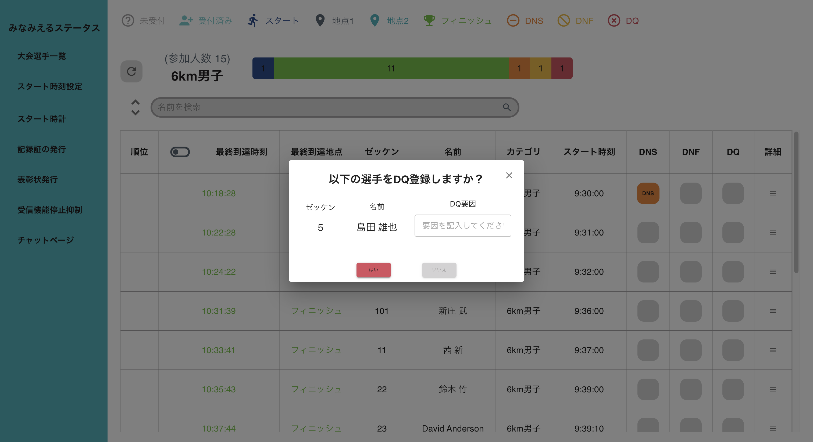

# トレイルランニング、位置情報計測システム 🏃‍♀️
> トレイルラン大会現場の「いま」を可視化し、運営チームの意思決定を支援する監視アプリケーション


[](https://ja.react.dev/)
[](https://www.typescriptlang.org/)
[](https://mui.com/)
[](./LICENSE)

---

## 📚 Table of Contents
1. [プロダクト概要](#プロダクト概要)
2. [背景と狙い](#背景と狙い)
3. [主な機能](#主な機能)
4. [画面イメージ](#画面イメージ)
5. [アーキテクチャ](#アーキテクチャ)
6. [技術スタック](#技術スタック)
7. [セットアップ](#セットアップ)
8. [コマンド一覧](#コマンド一覧)
9. [テスト戦略](#テスト戦略)
10. [ディレクトリ構成](#ディレクトリ構成)
11. [データとモックAPI](#データとモックapi)
12. [工夫したポイント](#工夫したポイント)
13. [今後の展望](#今後の展望)
14. [ライセンス](#ライセンス)

---

## プロダクト概要
みなみえるトレイルラン位置情報計測システム は、トレイルラン大会の運営本部・計測スタッフ向けに設計した監視アプリです。
カテゴリ別の進行状況やランナー個別の通過データをリアルタイムで把握し、DNS/DNF/DQ などの異常系ハンドリング、現場スタッフ間のコミュニケーションを支援します。

- **対象ユーザー**: システム設計者、大会運営責任者、ボランティアスタッフ
- **解決したい課題**: 現状ではシステム設計者（クライアント）が大会運営に常時関与せざるを得ない状況にあり、運営負荷が集中している。本プロジェクトでは、運営者やボランティアスタッフでも容易に利用可能な UI/UX を提供することで、クライアントの作業を大幅に削減するとともに、情報管理の一元化、ステータス把握の迅速化、スタッフ間の円滑な連携を実現する。
- **価値**: 状況の即時可視化と意思決定プロセスの標準化により、運営上のリスクを低減し、判断スピードを向上。これにより、年間約20大会のサポート実績を、将来的には50大会規模へと拡大可能な体制を目指します。
-
---

## 背景と狙い
- トレイルラン大会の現場では、コース状況やランナーのコンディション、気象変化など複数の要因が複雑に絡み合い、運営側は常に迅速かつ柔軟な意思決定を求められます。
- しかし現行の運営フローでは、選手情報をWebブラウザで表示する仕組みがあるものの、画面構成や操作性が分かりにくく、システムに精通した限られた担当者しかスムーズに活用できないという課題が存在します。
- 本アプリケーションは、こうした課題を解決し、「誰が」「どこにいて」「次に何をすべきか」 を運営チーム全員が直感的に把握できる仕組みを提供することで、現場の意思決定スピードと安全性を大幅に向上させることを目的としています。

---

## 主な機能

<table>
  <thead>
    <tr>
      <th style="width:220px; white-space:nowrap;">カテゴリ</th>
      <th style="width:220px;">機能</th>
      <th style="width:600px; word-wrap:break-word; white-space:normal;">詳細</th>
    </tr>
  </thead>
  <tbody>
    <tr>
      <td>ダッシュボード</td>
      <td>カテゴリ別ステータスバー / 合計バー</td>
      <td><code>countStatusByCategory</code> と <code>getTotalStatusList</code> で未受付〜フィニッシュを集計し、MUI カスタムバーで可視化</td>
    </tr>
    <tr>
      <td>選手管理</td>
      <td>ランナー一覧（PC / モバイル）</td>
      <td><code>RaceEntryTableDesktop</code> / <code>RaceEntryTableMobile</code> を状況別に出し分け、検索・並び替え・レスポンシブ対応を実装</td>
    </tr>
    <tr>
      <td>異常系ハンドリング</td>
      <td>DNS/DNF/DQ 登録・解除ダイアログ</td>
      <td><code>RunnerStatusPopupDialog</code> で登録理由を必須化し、<code>palette</code> に基づいた色分けで状態を強調</td>
    </tr>
    <tr>
      <td>タイム詳細</td>
      <td>地点通過記録の可視化</td>
      <td><code>RunnerTimeDetailPopup</code> / <code>RunnerTimeDetailMobilePopup</code> で地点ごとの到達時刻・区間ラップ・順位（<code>rankingByLocation</code>）を表示</td>
    </tr>
    <tr>
      <td>スタート時刻設定</td>
      <td>モバイル/デスクトップ対応ピッカー</td>
      <td><code>StartTimeSettingDialog</code> と MUI <code>DateTimePicker</code> を拡張し、大型フォント・一括適用など大会現場での UX を最適化</td>
    </tr>
    <tr>
      <td>チャット</td>
      <td>ルーム別コミュニケーション</td>
      <td><code>ChatPage</code> / <code>ChatRoom</code> + <code>server/mockChatServer.ts</code> により、場所ごとにスタッフチャネルを分割。送信・ポーリング・セッション管理を実装</td>
    </tr>
    <tr>
      <td>レイアウト</td>
      <td>サイドバー + モバイルヘッダー</td>
      <td><code>SidebarLayoutPage</code> と <code>useResponsive</code> でブレイクポイントごとに UI/UX を切り替え、現場端末（スマホ）でも操作しやすい設計</td>
    </tr>
    <tr>
      <td>ログイン</td>
      <td>管理者 / スタッフ用フォーム</td>
      <td><code>AuthForm</code> で入力項目をロールごとに出し分け、視認性を高めた MUI テーマで実装</td>
    </tr>
  </tbody>
</table>


---

## 画面イメージ
<table>
  <tr>
    <th>ダッシュボード</th>
    <th>カテゴリ詳細（ランナー一覧）</th>
  </tr>
  <tr>
    <td></td>
    <td></td>
  </tr>
  <tr>
    <td>カテゴリ別ステータスバーと合計バーで全体進捗を俯瞰。モバイルでは地点一覧を横スクロールで閲覧できる設計。</td>
    <td>カテゴリごとのランナー一覧／検索／並び替え／DNS/DNF/DQ 登録／タイム詳細ポップアップに対応。</td>
  </tr>

  <tr>
    <th>検索</th>
    <th>並び替え</th>
  </tr>
  <tr>
    <td></td>
    <td></td>
  </tr>
  <tr>
    <td>曖昧検索で選手名,カテゴリ名などで検索し情報到達までの時間を最短に。</td>
    <td>端末幅に合わせた UI で昇順／降順切替などを提供。</td>
  </tr>

  <tr>
    <th>並び替え結果</th>
    <th>DNS登録</th>
  </tr>
  <tr>
    <td></td>
    <td></td>
  </tr>
  <tr>
    <td>ゼッケン番号を昇順に並べた結果</td>
    <td>DNS(Don't Start(スタートしなかった選手))を登録するpopup</td>
  </tr>

<tr>
    <th>DNF登録</th>
    <th>DQ登録</th>
  </tr>
  <tr>
    <td></td>
    <td></td>
  </tr>
  <tr>
    <td>DNF(Don't Finish(最後まで走れず途中リタイアした選手を登録する))</td>
    <td>DQ(Disqualified（失格）した選手を登録するpopup</td>
  </tr>

<tr>
    <th></th>
    <th></th>
  </tr>
  <tr>
    <td></td>
    <td></td>
  </tr>
  <tr>
    <td></td>
    <td></td>
  </tr>

</table>


---

## アーキテクチャ

```plaintext
frontend/trailrunapp-frontend   (React 19 + TypeScript + MUI)
├─ features/
│   ├─ dashboard/              # レース全体のステータス集計 UI
│   ├─ category_race/          # カテゴリ別詳細、DNS/DNF/DQ 管理
│   ├─ Sidebar/                # PC/モバイル共通のレイアウト制御
│   ├─ chat/                   # チャットルーム UI + API 呼び出し
│   └─ Auth/                   # 管理者/スタッフログイン画面
│
├─ components/
│   ├─ RaceEntryTable/         # レスポンシブなランナー表 (Desktop/Mobile)
│   ├─ StartTime/              # MUI DateTimePicker カスタマイズ群
│   └─ button(popup)/          # ボタン & ポップアップ共通パーツ
│
├─ data/
│   ├─ runners*.ts             # ダミー選手データ
│   └─ rooms.ts                # チャットルーム定義
│
├─ hooks/                      # useResponsive, useRunnersData
├─ utils/                      # 集計 / 配色 / ランキング / チャットAPI クライアント
│
server/
└─ mockChatServer.ts           # Node.js + http ルームID・セッションID単位でメッセージを保持するモック
```


- **依存関係**: フロントエンドは `react-scripts` を利用した CRA ベース。バックエンドは Node.js 純正 HTTP サーバーでモックのみを提供し、データベースは未使用です。
- **通信**: フロントは `fetch` を通じて `http://localhost:4000` のモックサーバーへアクセス（`REACT_APP_CHAT_API_BASE_URL` で変更可）。`StatusLegend` は `/api/statuses` へのリクエストを想定しており、本番では別途 API 実装または MSW 等のモックが必要です。
- **レスポンシブ**: `useMediaQuery` ベースの `useResponsive` フックで 4 つのブレイクポイント（小型モバイル / モバイル / タブレット / デスクトップ）に対応。

---

## 技術スタック
| レイヤー | 技術 |
|----------|------|
| UI | React 19, TypeScript, React Router 7, MUI v7, @mui/x-date-pickers |
| 状態/ロジック | React Hooks, カスタムフック (`useResponsive`, `useRunnersData`), ユーティリティ (`aggregateRaceData`, `rankingByLocation`) |
| テスト | Jest, React Testing Library, `jest.mock` による API スタブ, Hook テスト (`renderHook`) |
| ツール | CRA (`react-scripts`), ESLint, MSW（導入準備のため依存追加済み）, Day.js |
| サーバーモック | Node.js (ts-node), `server/mockChatServer.ts` |
| その他 | Shields.io バッジ、`package.json` の `proxy` 設定でチャットAPIへの CORS 対策 |

---

## セットアップ
### 1. 前提
- Node.js 18 以上を推奨（LTS での検証）
- npm または pnpm（このリポジトリでは npm スクリプトを定義）
- `server/mockChatServer.ts` を動かすために TypeScript 実行環境（`ts-node` は devDependencies に同梱）

### 2. 依存関係のインストール
```bash
# ルートにいる場合
npm install

# フロントエンドのみをインストールしたい場合
cd frontend/trailrunapp-frontend
npm install

3. モックチャットサーバーの起動
npm run mock:chat
# => http://localhost:4000 でモックAPIが起動
4. フロントエンドの起動
cd frontend/trailrunapp-frontend
npm start
# => http://localhost:3000 で開発サーバーを起動
.env に REACT_APP_CHAT_API_BASE_URL を設定すると、チャットAPIの接続先を任意のエンドポイントに切り替え可能です。

proxy 設定により、開発時は /rooms/... のリクエストを自動的に localhost:4000 にフォワードします。

コマンド一覧
コマンド	目的
npm start	CRA 開発サーバー起動
npm test	Jest + React Testing Library によるテスト
npm run build	本番ビルド
npm run lint	ESLint（src/**/*.ts(x) を対象）
npm run mock:chat	Node.js モックチャットサーバー起動（ルート直下）
テスト戦略
ユニットテスト:

features/chat/__tests__/chatApi.test.tsx … セッションID生成やヘッダ付与の検証

components/StartTime/usePickerControllers.test.ts … 日時ピッカーの状態遷移を確認

コンポーネントテスト:

ChatRoom.test.tsx … メッセージ送信・ポーリング・ルーム切り替えの挙動を検証

ChatPage.test.tsx … ルーティングとUIスイッチングの確認（将来的に実装と合わせて更新予定）

今後の課題:

本番APIへの全面移行
概要: 既存のダミーデータ・モックAPIを、クライアント提供の本番APIへ置き換える
実装方針: APIクライアント層を分離（BFF/adapter化）し、エンドポイント・スキーマ差分を吸収。段階的に画面単位で切り替え（Dashboard→カテゴリ→詳細→凡例）
検証: モック（MSW）と本番APIのレスポンス整合性チェック、集計メトリクス（合計値・比率）不変の自動テスト
完了条件: 主要画面が本番APIのみで機能し、モックは開発/CI用に残す（切替フラグで運用）

Chat の履歴保持と挙動改善
概要: ルーム切替後もメッセージ履歴を継続表示し、実運用時の参照性を担保
実装方針: 取得APIにページング/カーソル/期間指定を追加、クライアントはルームごとに履歴キャッシュ＋未読管理。送信即時反映＋サーバ確定でID・タイムスタンプ更新
検証: ルーム切替後の履歴持続、連投時のスクロール安定、オフライン/再接続時の再同期
完了条件: 主要フロー（送信→反映→切替→復帰）がE2Eでグリーン、運用で必要な期間の履歴が即参照可能

ログイン認証（管理者/スタッフ）
概要: ロールに応じた機能制御と監査性の確保（登録・解除操作の追跡）
実装方針: 認証APIと連携（email/password or SSO）、トークン保管はメモリ＋リフレッシュで安全性を確保。ルートガードで未認証をログインへ誘導、権限に応じてUI出し分け
検証: 期限切れリフレッシュ、権限別UI（登録/解除ボタンの表示）、保護ルート遷移
完了条件: 認証必須画面が正しく保護され、権限に応じた操作のみ実行可能。最小限の監査ログ（誰が・いつ・何を）を記録

ディレクトリ構成
minamieru/
├── README.md
├── package.json
├── server/
│   └── mockChatServer.ts     # ルーム/セッション別にメッセージを保持するHTTPモック
└── frontend/
    └── trailrunapp-frontend/
        ├── package.json
        ├── src/
        │   ├── App.tsx / AppRouterWithDialog.tsx
        │   ├── routes/AppRoutes.tsx
        │   ├── features/
        │   │   ├── dashboard/
        │   │   ├── category_race/
        │   │   ├── chat/
        │   │   ├── Auth/
        │   │   └── Sidebar/
        │   ├── components/
        │   │   ├── StartTime/
        │   │   ├── button/ & button_popup/
        │   │   └── RaceEntryTable*
        │   ├── hooks/
        │   ├── data/
        │   └── utils/
        └── public/
            └── index.html など
データとモックAPI
src/data/runners_*.ts: 実際の計測システムに接続する前提で、ダミー選手データを定義。

aggregateRaceData.ts: DNS/DNF/DQ を優先した集計ロジックを実装し、未受付～フィニッシュまでの人数を算出。

rankingByLocation.ts: 区間タイムを算出し、同着処理を考慮した順位計算を提供。

StatusLegend: /api/statuses へのGETを想定。現在はバックエンド未実装のため、MSWやBFFなどでレスポンスを模擬してください。

チャット機能は server/mockChatServer.ts が提供するメモリモック（永続化なし）を利用。セッション識別には X-Session-Id ヘッダを使用。

工夫したポイント
レスポンシブ最適化

useResponsive でブレイクポイントを定義し、テーブル/カード/ボタンのサイズを動的に調整。

モバイル専用 UI (MobileHeader, MobileCards) を用意してスクロール量と操作ステップを削減。

運営現場での可読性向上

クライアントからの要望に基づき、フォントサイズを大きめに設定しました。これは、ボランティアスタッフの中にスマートフォン操作に不慣れな高齢者が含まれることや、
屋外の日光下・暗いテント内といった視認性に課題のある環境でも見やすく操作できるように配慮したものです。

カラーリングは palette / statusColorMap に集約し、DNS/DNF/DQ などの重要ステータスを瞬時に判別可能。

業務フローを想定した UX

RunnerStatusPopupDialog で登録/解除を同一コンポーネントで扱い、理由入力を必須化することでヒューマンエラーを低減。

StartTimeSettingDialog ではカテゴリ単位と一括適用の両方をサポートし、直前の変更にも柔軟に対応できるようにしました。

コミュニケーションの高速化

チャット機能は 3 秒間隔のポーリング + セッションIDで再取得時の重複送信を防止。

ChatRoom 現状はルームを切り替えると、自分の送信したメッセージがサーバー側で保持され、モックサーバー経由で相手側のメッセージ欄に出力される実装となっています。これは暫定的な動作であり、今後はルーム切り替え時にもメッセージ履歴を保持し、大会中は常に全ての履歴を参照できる仕様へと拡張予定です。実際の運営現場では複数地点を切り替えて状況を把握する必要があるため、履歴の継続的な保持はオペレーション上不可欠と位置付けています。

今後の展望
 StatusLegend 用 API / MSW ハンドラの整備

 計測システムからのリアルタイム連携（WebSocket / SSE）への対応

 認証基盤との接続（スタッフごとの権限管理や監査ログの蓄積）

 UI テーマのブランド統一とライト/ダークモード

 Playwright を用いた E2E テストでの品質ゲートライン構築

 PWA 化・オフラインキャッシュ（山間部でのネットワーク断を想定）

ライセンス
本リポジトリのソースコードは MIT License の下で公開しています。
大会固有のデータや画像を追加する際は、各権利元のポリシーに従ってください。

大会運営に関わるすべてのメンバーが安心して挑戦できる環境を整えるため、このダッシュボードが力になれば嬉しいです。ご意見・ご要望はお気軽にお寄せください。
